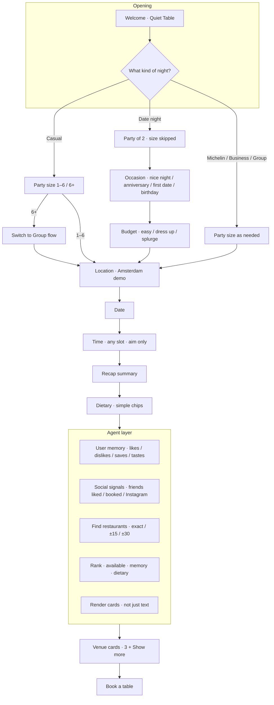

# Agentic Booking Flow — Planning

UI-first booking with an agent that finds and books the table. Use this doc to demo structure without the live prototype.

---

## Flow / architecture

**One-liner:** UI gathers the brief; the agent finds the table — casual stays lean, date night adds occasion and budget, and memory + social taste make the picks feel personal.

---

## Key UX decisions — Casual vs Date night

| | **Casual** | **Date night** |
|--|------------|----------------|
| Party size | Ask · 1–6, **6+ becomes Group** | **Skip** · always 2 |
| Extra beats | None | **Occasion** then **Budget** |
| Tone | Easy, unfussy | Intimate · ceremony + spend matter |
| After summary | Same path | Same path |

Shared after location: **date → time (aim, not availability) → summary → dietary → agent finds tables.**

### Time & availability (important)

- User picks **any** time they want to aim for — slots are never greyed out as “booked” before restaurants exist.
- Agent returns venues with a table at that **exact time**, or within **±15 / ±30 minutes**.
- **Sparse (&lt;3 results):** stretch into the ±15–30 window so the list isn’t empty or thin.
- **Plentiful (4+ exact):** most cards stay exact; ~2 are offered at **+15 min** with honest copy (a strong find is worth waiting a little).
- Card copy: `Available at 8:00pm` · `Available at 8:15pm` · `Available at 8:30pm` (exact / +15 / ±30).

### Budget note (future)

Spend tiers are semantic (`easy` / `dress up` / `splurge`). Euro ranges should become **location-aware** later (Paris/London ≠ Leeds/Rotterdam). Demo bands are Amsterdam-oriented for now.

---

## “Agents” at play (plain language)

1. **Wizard (UI)** — Fast structured questions; no guessing party size or date.
2. **Booking agent** — After the recap, finds restaurants, checks times (exact / ±15 / ±30; plentiful +15 mix), returns **cards**.
3. **Memory / social layer** — Knows *you* (liked / disliked / quiet / veg) and shows *friends* signals on cards.
4. **Fallback vs live** — Demo uses mock Amsterdam catalog; live demo flips on real search (e.g. Paris).

---

## Social graph — what we have today

**Already in the product (demo/mock):**
- Your own history — places liked, disliked, or saved
- Standing tastes — quiet preference, vegetarian lean
- Friend/social signals on cards — liked / booked / Instagram
- Named-guest prefs — e.g. dietary for a contact (live agent path)

**Parked for later:**
- Maps favourites / public restaurant guides
- Blog “picks” lists as a stand-in for those guides

---

## Related docs

- **UX decisions (demo talk track):** `ux-decisions.md`
- **AX terminology brain:** `ax-brain.md` — orchestration layer, five surfaces, glossary
- Product rules: `rules.md`
- UX narrative and open tidy items: `ux-notes.md`
- Decision log: `ux-decisions-log.txt`
