# Taste profile schema — shared plan (React + iOS)

Locks onboarding, memory, ranking, and social handoff to one model before screens ship.  
**Fallback rule:** same as booking — mock/local until live agent is on. Onboarding writes real profile data; ranking and copy can use catalog + rules without API credits.

Related: `agentic-booking-flow-planning.md`, `ax-brain.md`, `src/lib/user-memory.ts`, `src/lib/friend-graph-mock.ts`, iOS `FriendGraphMock.swift`.

---

## Goal

One profile object per user that:

1. **Onboarding seeds** (skippable steps, completable later)
2. **Passive moments update** (wizard, book, save, dislike)
3. **Ranking + card copy consume** (fallback rules today, agent tomorrow)
4. **Social graph attaches later** without reshaping taste fields

---

## Canonical schema (TypeScript)

Swift mirrors these names in `TasteProfile.swift` (to create). JSON is the cross-platform interchange format.

```ts
/** Shared enums — keep in sync with venue-options.ts + iOS BookingModels */
type DietaryNeeds = 'none' | 'vegetarian' | 'vegan' | 'mixed';
type NoisePreference = 'quiet' | 'lively' | 'any';
type VenueReaction = 'love' | 'fine' | 'not_for_me' | 'never_been';

type CuisineId =
  | 'italian'
  | 'french'
  | 'mexican'
  | 'seafood'
  | 'japanese'
  | 'middle-eastern'
  | 'modern-european'
  | 'steak-grill'
  | 'vegetarian-forward'
  | 'other';

type TasteConfidence = 'low' | 'medium' | 'high';

type OnboardingStepId =
  | 'basics'
  | 'last_meal'
  | 'vibe'
  | 'cuisine'
  | 'venue_quiz'
  | 'invite_friends';

type TasteProfile = {
  /** Stable user id — local UUID in friends beta; auth id later */
  userId: string;
  /**
   * Required at signup — only identity field in friends beta.
   * Shown in welcome (“Welcome, maya”) and friend social lines (“maya booked last month”).
   * Lowercase, 2–20 chars, letters/numbers/underscore; validated on save.
   * No email / phone in v1 — iOS-friendly, invite graph uses userId + username later.
   */
  username: string;
  homeArea: string;
  homeCoordinates?: {lat: number; lon: number};

  preferences: {
    noise?: NoisePreference;
    dietaryLean?: DietaryNeeds;
    cuisineAffinities?: CuisineId[];
    notes?: string;
  };

  /** Explicit signals — strongest rank input */
  anchorVenueIds: string[];
  excludedVenueIds: string[];

  /** From “Have you eaten at these?” — venue id → reaction */
  venueReactions: Record<string, VenueReaction>;

  /** Free-text last meal — resolved to catalog id when possible */
  lastMeal?: {
    rawText: string;
    resolvedVenueId?: string;
    capturedAt: string;
  };

  /** Visit history — same shape as today’s UserMemory.recentVisits */
  recentVisits: VenueVisit[];
  savedVenueIds: string[];

  /** Social — empty in friends beta until invite graph ships */
  social?: {
    friendUserIds: string[];
    /** Passive booking/save visibility — mutual opt-in later */
    showFriendActivity: boolean;
    /** Onboarding invite step — up to 3; works without backend in beta */
    invites?: {
      /** Soft goal — UI shows “2 of 3” not a hard block */
      targetCount: 3;
      /** Share events (link copied, SMS opened, etc.) */
      sent: PendingInvite[];
    };
  };

type PendingInvite = {
  /** Optional nickname — “Who did you invite?” not required */
  label?: string;
  sentAt: string;
  channel: 'share_sheet' | 'sms' | 'copy_link';
};

  onboarding: {
    completedAt?: string;
    skippedSteps: OnboardingStepId[];
    /** Derived — see computeTasteConfidence() */
    tasteConfidence: TasteConfidence;
  };

  updatedAt: string;
};

type VenueVisit = {
  venueId: string;
  visitedAt: string;
  rating: 'liked' | 'disliked' | 'neutral';
  source: 'quiz' | 'booking' | 'manual' | 'inferred';
  notes?: string;
};
```

### Extends (does not replace) `UserMemory`

Today `getUserMemory()` returns a demo persona. Migration path:

| Current `UserMemory` | New home |
|----------------------|----------|
| `firstName` | `TasteProfile.username` (display as-is; capitalize in UI if desired) |
| `homeArea` | `TasteProfile.homeArea` |
| `preferences.noise`, `dietaryLean`, `notes` | `TasteProfile.preferences` |
| `recentVisits` | `TasteProfile.recentVisits` (+ `source`) |
| `savedVenueIds` | `TasteProfile.savedVenueIds` |
| — | `anchorVenueIds`, `excludedVenueIds`, `venueReactions`, `onboarding` |

Agent context: `summarizeUserMemoryForAgent()` becomes `summarizeTasteProfileForAgent(profile)` — passes `username`, not email.

---

## Identity (friends beta)

| Field | Required | Notes |
|-------|----------|-------|
| `username` | **Yes** | Single table-stakes field before intent cards |
| `email` | No | Skip entirely for iOS + web friends beta |
| `phone` | No | Later, if invite/SMS needed |
| `userId` | Auto | UUID on first launch — backend key when auth ships |

**Username rules (v1):**
- 2–20 characters; `a-z`, `0-9`, `_` only (store lowercase)
- Uniqueness: local-only in beta; server-enforced when friends graph has backend
- Welcome copy: `Welcome, {username}.` — same string on social cards: `{username} booked last month`
- Optional later: separate `displayName` if handles feel too IRC; not in v1

**Why username not first name:** doubles as social attribution without collecting PII. Fits “few friends” — people know each other’s handles from the invite.

---

## `tasteConfidence` — derived, not asked

Drives copy assertiveness and whether social-style lines appear.

| Level | Rough rule | UX |
|-------|------------|-----|
| **low** | Default; &lt;2 strong signals | Humble agent copy; no friend lines; fit/availability meta only |
| **medium** | ≥2 of: vibe, cuisine, quiz (≥3 reactions), last meal resolved, 1 anchor | “Based on what you told me…”; rank skew active |
| **high** | medium + (≥5 quiz reactions or ≥2 anchors or visit history) | Exclusions enforced; strong personalization note |

```ts
function computeTasteConfidence(p: TasteProfile): TasteConfidence {
  let score = 0;
  if (p.preferences.noise) score += 1;
  if (p.preferences.cuisineAffinities?.length) score += 1;
  if (p.lastMeal?.resolvedVenueId) score += 2;
  if (p.anchorVenueIds.length) score += 2;
  if (Object.values(p.venueReactions).filter((r) => r === 'love' || r === 'not_for_me').length >= 3) score += 2;
  if (p.recentVisits.length) score += 1;
  if (score >= 5) return 'high';
  if (score >= 2) return 'medium';
  return 'low';
}
```

---

## Onboarding steps → writes

Every step **skippable** → append step id to `onboarding.skippedSteps`.  
Progress UI: `6 - skippedSteps.length` of “core” steps (optional banner).

| Step | UI | Writes | Fallback behaviour |
|------|-----|--------|-------------------|
| **basics** | Username (required); home area | `username`, `homeArea`; iOS also `homeCoordinates` | React: manual or Nominatim; iOS: CoreLocation. **No email field.** |
| **last_meal** | “Last place you loved?” search/text | `lastMeal.rawText`; fuzzy match → `resolvedVenueId` + `anchorVenueIds` | Match against **catalog ids only** (`findVenueOption`) — no live search |
| **vibe** | Quiet / either / buzzy chips | `preferences.noise` | — |
| **cuisine** | Multi-select genre chips | `preferences.cuisineAffinities` | Static chip list; map to catalog `subtitle`/tags heuristically in ranker |
| **venue_quiz** | 6–8 real venues, 4 reactions each | `venueReactions`; `love` → anchor + `recentVisits`; `not_for_me` → exclude | **Fixed list** from shared JSON — see below |
| **invite_friends** | Invite up to 3 people (see copy below) | `social.invites.sent[]`; optional `label` per slot | **No backend:** iOS share sheet / SMS; React copy link. Deep link `?ref={userId}` stored for later matching |

After onboarding (or skip): land on **existing intent cards** — no hard gate.

---

## Invite friends step — copy & UX

**Placement:** last onboarding beat, after taste quiz — user understands *what* the app is before asking *who* to bring.

**Goal:** seed the social graph; frame invites as **taste trust**, not growth spam.

### Recommended copy (primary)

| Element | Text |
|---------|------|
| **Headline** | Who has great taste? |
| **Body** | Invite up to three people whose restaurant picks you’d actually take. When they’re on Quiet Table, you’ll see where they’ve booked — no reviews, just where they went. |
| **CTA** | Send invite |
| **Skip** | Maybe later |
| **Progress** | 2 of 3 invited · soft counter, not blocking |

### Alternates (A/B or tone tweak)

**Option B — recommendation frame**  
- Headline: *Whose tip was your last great meal?*  
- Body: *Bring them in. You’ll see each other’s tables — the easiest way to find somewhere worth booking.*

**Option C — quieter / concierge**  
- Headline: *A few people you trust*  
- Body: *Quiet Table gets better with friends whose taste you know. Invite three — we’ll show their bookings when they join, nothing else.*

**Option D — shortest**  
- Headline: *Who do you eat like?*  
- Body: *Invite friends with good taste. Their bookings become yours to browse.*

### UX rules

- **3 slots** — visual row of invite cards; each opens share sheet (iOS) or copy-link (React)
- **Optional nickname** per slot (“Maya”, “Savas”, “Emma”) — stored in `PendingInvite.label`; shows as pending until they join: *“Waiting for Maya”*
- **Demo placeholder names** for onboarding UI mockups: **Savas**, **Maya**, **Emma** — match synthetic friend graph below
- **Skip anytime** — no guilt copy; nudge again from Settings → “Invite friends”
- **Never** access contacts silently — share sheet only; contacts import is a later opt-in
- **Fallback:** invite link works without server; friend match deferred to P2 backend

### Invite message (pre-filled share text)

> {username} invited you to Quiet Table — see where friends actually eat and book a table. [link]

Keep it one line; no “join my network” energy.

---

## Demo friend graph (synthetic profiles)

Three **close friends** seed the friend UX before real users join. Same data on **web** (`src/lib/friend-graph-mock.ts`) and **iOS** (`FriendGraphMock.swift`). Replace with real picks when Savas / others onboard.

**Rules:**
- Never invent friend visits — only show social lines for venues in a friend’s `topPicks`
- Mention friend in composer at results → rank boost + intro copy (*“factoring in Maya's taste…”*)
- Card line format: `{name} booked here {when}` (matches `formatSocialProof` on web)
- Agent tool: `get_friend_food_profile` (name: `Savas` | `Maya` | `Emma`)
- **Savas is real (pending)** — swap mock picks for his actual recs after friends beta; keep Maya & Emma synthetic until replaced

### Savas Ozay

| Field | Value |
|-------|--------|
| **id** | `savas` |
| **Taste** | Ramen, Korean BBQ, Asian fusion |
| **Best for brief** | Casual, group, date-night Asian |

| venueId | Role | Note |
|---------|------|------|
| `genki` | Casual ramen | Go-to tonkotsu — quick, fun |
| `kimchi-premium` | Korean BBQ, group | Table grills — banchan is the star |
| `taiko` | Date-night Asian fusion | Sharing plates, dim room, cocktails |

**Try:** Date night + *“factor in Savas's taste”* → **Taiko** rises.

---

### Maya Chen

| Field | Value |
|-------|--------|
| **id** | `maya` |
| **Taste** | Quiet date nights, natural wine, greenhouse dining |
| **Best for brief** | Date night, special occasion |

| venueId | Role | Note |
|---------|------|------|
| `de-kas` | Date-night greenhouse | Anniversary pick — unhurried service |
| `fitchers` | Date-night wine bar | Natural wine, conversation-friendly back room |
| `restaurant-cedric` | Date-night French | Classic bistro without the tourist crush |

**Try:** Date night + *“what would Maya pick?”* → **De Kas** / **Fitcher's** rise.

---

### Emma van Dijk

| Field | Value |
|-------|--------|
| **id** | `emma` |
| **Taste** | Group dinners, Italian, shareable tables |
| **Best for brief** | Group, casual Italian |

| venueId | Role | Note |
|---------|------|------|
| `cecconis` | Group Italian, lively | Default for six-plus — long tables |
| `momo` | Group Pan-Asian | Seats bigger parties properly |
| `gruppo-di-amici` | Casual Italian | Low-key pasta night, no reservation stress |

**Try:** Group + *“Emma's taste”* → **Cecconi's** / **MOMO** rise.

---

### Friend graph schema (mirrors taste profile picks)

```ts
type FriendPick = {
  venueId: string;
  title: string;
  vibe: string;           // used for intent alignment in friendRankScore
  note: string;           // agent + future profile UI
  visitedAt: string;      // ISO date — drives "last month" on cards
  rating: 'loved' | 'liked';
};

type FriendFoodProfile = {
  id: string;
  name: string;
  fullName: string;
  relationship: 'close_friend';
  homeArea: string;
  tasteSummary: string;
  cuisineAffinities: string[];
  topPicks: FriendPick[];
};
```

### Ranking when friend is mentioned

```ts
// friendRankScore — web + iOS parity
// +6 date-night vibe + date intent
// +5 group vibe + group intent
// +4 casual vibe + casual intent
// +4 loved / +2 liked base
```

### Sync checklist (when updating friends)

- [ ] `friend-graph-mock.ts` — `DEMO_FRIENDS` array
- [ ] `FriendGraphMock.swift` — `demoFriends` array
- [ ] Catalog includes all `venueId`s in intent pools (date / group / casual)
- [ ] Agent `SYSTEM_PROMPT` demo friend list
- [ ] Remove conflicting hardcoded `social_proof` on same venues in catalog (friend line wins via enrich)

---

## Venue quiz — shared asset (fallback-safe)

File: `src/data/taste-quiz-venues.json` (React) + copied into iOS bundle.

Pick 8 Amsterdam venues **already in catalog** with images:

| id | why |
|----|-----|
| `bar-fisk` | buzzy seafood |
| `de-kas` | date / greenhouse |
| `cafe-de-klos` | classic casual |
| `sla-amsterdam` | veg-forward |
| `rijks` | fine / museum |
| `cecconis` | Italian dress-up |
| `momo` | Asian |
| `graphite` | saved-venue demo parity |

Reaction mapping:

| Reaction | Effect |
|----------|--------|
| `love` | `anchorVenueIds`, visit `liked` source `quiz` |
| `fine` | small rank boost |
| `not_for_me` | `excludedVenueIds`, visit `disliked` source `quiz` |
| `never_been` | no write |

---

## Passive moments → updates

Learning continues without re-onboarding.

| Moment | Where | Writes |
|--------|-------|--------|
| Location pick (wizard) | React/iOS wizard | `homeArea` if empty |
| Intent + occasion + spend | Wizard | session draft only; optional `preferences.notes` append on summary |
| Dietary chips | Wizard | `preferences.dietaryLean` |
| Book table | Results | `recentVisits` liked source `booking`; clear `saved` if was saved |
| Save / share (future) | Card | `savedVenueIds` |
| Post-visit prompt (future) | Success | `recentVisits` rating update |
| Composer “too loud” etc. | Chat | live agent extracts → `preferences`; fallback: ignore or local keyword map |
| Settings → Your taste | Profile editor | any field |

---

## Ranking consumption (fallback today)

`rankVenueOptions()` gains taste inputs from profile:

1. **Exclude** `excludedVenueIds` + disliked visits (existing `isVenueExcluded`)
2. **Boost** anchors, loves, likes, saves (extend `memoryRankScore` → `tasteRankScore`)
3. **Cuisine** — keyword match on `subtitle` / manual venue tags (add optional `cuisineTags[]` to catalog later)
4. **Noise** — quiet lean boosts “quiet” descriptions; penalize “buzzy/lively” copy
5. **Social** — demo friends via `friendSocialProofForVenue` only; **no** random `mockSocialProofForVenue` once real user profile exists; synthetic graph uses three named friends above

Card meta priority (cold → warm): see onboarding plan — fit before fake friends.

---

## Storage (friends beta)

| Platform | V1 | Later |
|----------|-----|-------|
| React | `localStorage` key `quiet-table.taste-profile.v1` | auth + API |
| iOS | `UserDefaults` / JSON file | CloudKit or account |

Export/import JSON for debugging and cross-device test.

---

## Agent handoff (when live)

`POST /api/agent` body adds:

```json
{ "tasteProfile": { ... }, "tasteConfidence": "medium" }
```

System prompt: use profile for rank/copy; admit cold start when `low`; never invent friend names.

Until then: client-side rank + fallback intro copy — **profile still persists**.

---

## iOS ↔ React parity checklist

- [x] Demo friend graph — Savas, Maya, Emma (`friend-graph-mock.ts` + `FriendGraphMock.swift`)
- [ ] Same `TasteProfile` fields (Swift struct)
- [ ] Same `taste-quiz-venues.json`
- [ ] Same `CuisineId` + chip labels
- [ ] Same `computeTasteConfidence` logic (unit test both)
- [ ] Same reaction → anchor/exclude rules
- [ ] Settings “Your taste” edit on both
- [ ] Profile screen — same IA on both platforms

---

## Profile area — taste, invites, settings

Single **Profile** destination (not scattered modals). Entry from app chrome — not buried in chat.

### Entry points

| Platform | Entry | Notes |
|----------|-------|-------|
| **React** | Top-right avatar / username chip on `ChatLayout` | Opens profile sheet or `/profile` route |
| **iOS** | Toolbar person icon or username in nav bar | Push `ProfileView` |

Always reachable — user can complete skipped onboarding here anytime.

### Information architecture

```mermaid
flowchart TB
  P[Profile] --> A[Account]
  P --> B[Your taste]
  P --> C[Friends & invites]
  P --> D[Preferences]
  P --> E[About & data]

  A --> A1[Username · edit]
  A --> A2[Home area · edit]

  B --> B1[Taste summary + confidence]
  B --> B2[Complete missing steps]
  B --> B3[Retake venue quiz]
  B --> B4[Anchors & exclusions · view/edit]

  C --> C1[Invite link · copy / share]
  C --> C2[Pending invites · 3 slots]
  C --> C3[Friends on Quiet Table · when backend]

  D --> D1[Show friend activity · toggle]
  D --> D2[Location · iOS permission / manual]

  E --> E1[Clear local data]
  E --> E2[Export profile JSON · dev]
  E --> E3[Version · fallback mode indicator · dev]
  E --> E4[Privacy copy · stub]
```



---

### Section copy & content

#### 1. Account
Minimal — friends beta has no email.

| Row | Content |
|-----|---------|
| Username | Editable; same validation as onboarding |
| Home area | Neighbourhood / city; iOS “Use current location” |

Header: **`@{username}`** or display username with subtle “Member since {month}” when `onboarding.completedAt` exists.

#### 2. Your taste
The **completion hub** for skipped onboarding — dating-app “edit profile” pattern.

| Row | Source step | Empty state |
|-----|-------------|-------------|
| Vibe | vibe | “Add — quiet or buzzy?” |
| Cuisines | cuisine | “Add — what do you crave?” |
| Last great meal | last_meal | “Add a place you loved” |
| Places you know | venue_quiz | “Quick quiz — 2 min” |
| Dietary lean | wizard / preferences | From booking flow if set |

**Taste summary line** (derived):  
*“Quiet rooms · Italian & seafood · 4 places you love”* — or when `low`: *“Still learning your taste — add a few details.”*

**Progress ring / bar:** optional `6 - skippedSteps.length` — tap any row opens the **same component** as onboarding (not a duplicate form).

**Anchors & exclusions** (advanced, collapsed): list loved / not-for-me venues from quiz + visits; swipe to remove.

#### 3. Friends & invites
Same invite UX as onboarding — always available here.

| Element | Behaviour |
|---------|-----------|
| **Share link** | Primary button: Copy link · Share (iOS sheet) |
| **Link format** | `https://quiettable.app/join?ref={userId}` (or localhost path in dev) |
| **Invite slots** | 3 cards: empty → “Invite someone”; sent → “Waiting for {label}”; joined → friend row (P2) |
| **Body copy** | Reuse onboarding: *“Invite people whose picks you’d actually take.”* |

Secondary: **Invite more** after 3 — no hard cap long-term; onboarding just suggests 3.

#### 4. Preferences
Lightweight — expand only when needed.

| Setting | Default | Notes |
|---------|---------|-------|
| Show friend bookings on cards | on | When graph exists |
| Use location for search | on (iOS) | Links to system settings if denied |
| — | — | No notification toggles in v1 |

#### 5. About & data (housekeeping)
| Row | Action |
|-----|--------|
| Clear booking history | Confirm dialog; keeps taste profile |
| Reset taste profile | Confirm; wipes quiz/anchors, keeps username |
| Delete all local data | Nuclear; re-onboard |
| App version | Read-only |
| Agent mode | Dev only: “Local catalog” vs “Live agent” indicator |

No legal wall in v1 — one line privacy stub: *“Your taste profile stays on this device until you create an account.”*

---

### Profile vs onboarding — DRY rule

**One component set, two routes:**

| Component | Onboarding | Profile |
|-----------|------------|---------|
| `UsernameField` | step 1 | Account |
| `HomeAreaField` | step 1 | Account |
| `LastMealField` | step 2 | Your taste |
| `VibeChips` | step 3 | Your taste |
| `CuisineChips` | step 4 | Your taste |
| `VenueQuiz` | step 5 | Your taste |
| `InviteFriends` | step 6 | Friends & invites |

Editing in profile writes the same `TasteProfile` JSON; recompute `tasteConfidence` on save.

---

### React routing

| Route | Surface |
|-------|---------|
| `/` | Booking chat (existing) |
| `/profile` | Full profile page — or slide-over sheet from home |
| `/onboarding` | First-run only; redirects to `/` when `username` set + user taps through or skips all |

Deep link: `/join?ref={userId}` → onboarding with referrer stored.

---

### iOS structure

```swift
// Planning — not implemented
ProfileView
  ├── AccountSection
  ├── TasteSection      // NavigationLink → sub-screens reuse onboarding views
  ├── FriendsSection
  ├── PreferencesSection
  └── DataSection
```

Present from `OpeningScreen` toolbar — don’t interrupt active booking wizard.

---

### Nudges → Profile (not modal spam)

| Trigger | Nudge |
|---------|-------|
| Skipped quiz, first results | Inline banner: “Add places you know — better picks” → Profile › Your taste |
| Skipped invites, 2nd session | Subtle Profile badge dot |
| Post-first-book | Toast: “Invite someone with good taste?” → Profile › Friends |
| `tasteConfidence === 'low'` | Profile taste section shows empty rows prominently |

Never block booking.

---

### Schema additions for profile

```ts
type AppPreferences = {
  showFriendActivity: boolean;
  useLocationForSearch: boolean;
};

// Merge into TasteProfile or sibling object in same store:
type UserProfileStore = {
  taste: TasteProfile;
  preferences: AppPreferences;
};
```

Keep `social.invites` and `social.showFriendActivity` in taste profile for now; split `AppPreferences` if settings grow.

---

### Implementation order (profile)

Add after **Schema land**, parallel or right after **Onboarding shell**:

- [ ] Profile route / `ProfileView` shell with 5 sections (placeholder rows)
- [ ] Account: username + home area edit
- [ ] Friends: copy/share link + invite slot UI (reuse onboarding component)
- [ ] Your taste: list skipped steps with deep links to shared fields
- [ ] Housekeeping: clear data + version row
- [ ] Home chrome: profile entry avatar/username
- [ ] iOS parity

---

## Implementation order (next steps)

### 1. Schema land (no UI) — **do this first**
- [ ] Add `src/lib/taste-profile.ts` — types, `computeTasteConfidence`, load/save, migrate from `DEMO_USER_MEMORY` behind flag
- [ ] Add `src/data/taste-quiz-venues.json`
- [ ] Extend `rankVenueOptions` / `memoryRankScore` to read profile (fallback path)
- [ ] iOS: `TasteProfile.swift` + `TasteProfileStore.swift` mirror

### 2. Onboarding shell
- [ ] Route: first launch → onboarding flow vs home (`onboarding.completedAt` or skip-all)
- [ ] 6 skippable screens (basics → quiz → invite friends)
- [ ] Shared field components (used by onboarding + profile)

### 2b. Profile area
- [ ] `/profile` (React) + `ProfileView` (iOS) — 5 sections per IA above
- [ ] Share link in Friends section (same as onboarding invite step)
- [ ] Your taste — complete skipped steps; taste summary line
- [ ] Housekeeping — clear history / reset taste / version
- [ ] Profile entry in app chrome (avatar / username)

### 3. Wire wizard to profile
- [ ] Dietary → `dietaryLean`
- [ ] Book → visit write
- [ ] Replace “Welcome back, Aiden” with `Welcome, {username}.` or generic “Welcome.” if profile missing

### 4. Friends beta prep
- [ ] `userId` UUID per install
- [ ] Invite deep link `?ref={userId}` (store locally until backend)
- [ ] Remove production fake social for non-demo profiles
- [ ] Match `ref` → `friendUserIds` when backend lands

### 5. Live agent
- [ ] Pass `tasteProfile` in agent route
- [ ] Prompt rules for confidence levels
- [ ] Flip `USE_LOCAL_FALLBACK` when ready

---

## Open decisions

| # | Question | Recommendation |
|---|----------|----------------|
| 1 | Require identity before intent cards? | **Yes — username only** (no email) |
| 2 | Quiz length | 8 venues, swipe or card stack |
| 3 | Last meal free text when no catalog match | Store raw only; no anchor until resolved |
| 5 | Invite step mandatory? | **No** — soft “3 of 3” goal; skip + **Profile › Friends** return |
| 6 | Profile surface | Full page `/profile`; sheet optional on mobile web |
| 7 | Keep Aiden as dev persona | `DEV_DEMO_PERSONA=true` env flag |
| 8 | Cuisine tags on catalog | P1 heuristic on subtitle; P2 explicit `cuisineTags` on venues |

---

## Success criteria (friends beta)

- New user can skip all onboarding and still book
- User who completes quiz gets visibly different top 3 vs skip-all (same intent)
- Profile survives refresh (both platforms)
- No fake friend social lines for real profiles
- Same JSON export readable on React and iOS

---

*Last updated: 2026-08-19 — demo friend graph (Savas, Maya, Emma) wired on web + iOS; taste profile UI not yet implemented.*
